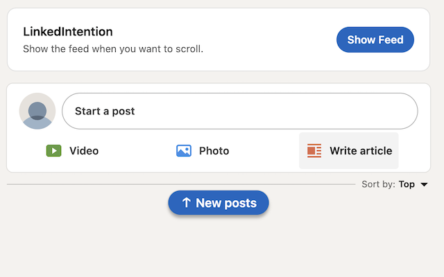

# LinkedIntention

A minimal [Chrome extension](https://chromewebstore.google.com/detail/linkedintention/clpocmehodfobdogjhpaienfadmkgklm) that requires a button press to show the LinkedIn home feed.

Two-shotted with OpenAI Codex.

## Screenshot

## Install (developer mode)

1. Open Chrome and go to `chrome://extensions`
2. Enable **Developer mode**
3. Click **Load unpacked**
4. Select this folder (`LinkedIntention`)

## What it does

- On `https://www.linkedin.com/feed/`, hides the feed content and shows a small card with a **Show Feed** button.
- Clicking **Show Feed** reveals the feed for the current tab session.

## Notes

- LinkedIn is a dynamic SPA; if they change DOM structure/classes, the selector may need updates in `src/content.js`.
